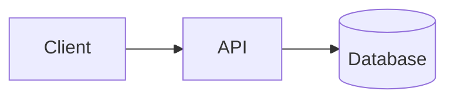

<!--
  README template for new repositories. Copy to the repo root as README.md and fill in.
  Keep it minimal and premium: one hero, no badge walls, no animations.
-->

<div align="center">
  <!-- " width="100%" /> -->
  <h1>Project Name</h1>
  <p><em>One-line description of what this is and who it's for.</em></p>
</div>

## Overview

What problem does this solve, and why does it exist? Two or three sentences.

## Architecture

<!-- Diagram (Mermaid or image). Describe the major components and how they interact. -->



## Features

- Feature one — what it does.
- Feature two — what it does.

## Tech stack

| Layer | Tools |
|---|---|
| <e.g. Mobile> | <Kotlin / Flutter / RN> |
| <e.g. Backend> | <FastAPI / Node> |
| <e.g. Data> | <PostgreSQL> |

## Getting started

### Prerequisites
- <runtime / SDK versions>

### Setup
```bash
git clone https://github.com/shubhamhingne/<repo>.git
cd <repo>
<one-command setup>
```

### Run
```bash
<command>
```

### Test
```bash
<command>
```

## Usage

Minimal example showing the primary use case.

## Roadmap

- [ ] Next milestone
- [ ] Future work

## Contributing

See [CONTRIBUTING](https://github.com/shubhamhingne/.github/blob/main/CONTRIBUTING.md).
Issues and PRs are welcome.

## License

[MIT](LICENSE) © Shubham Hingne
